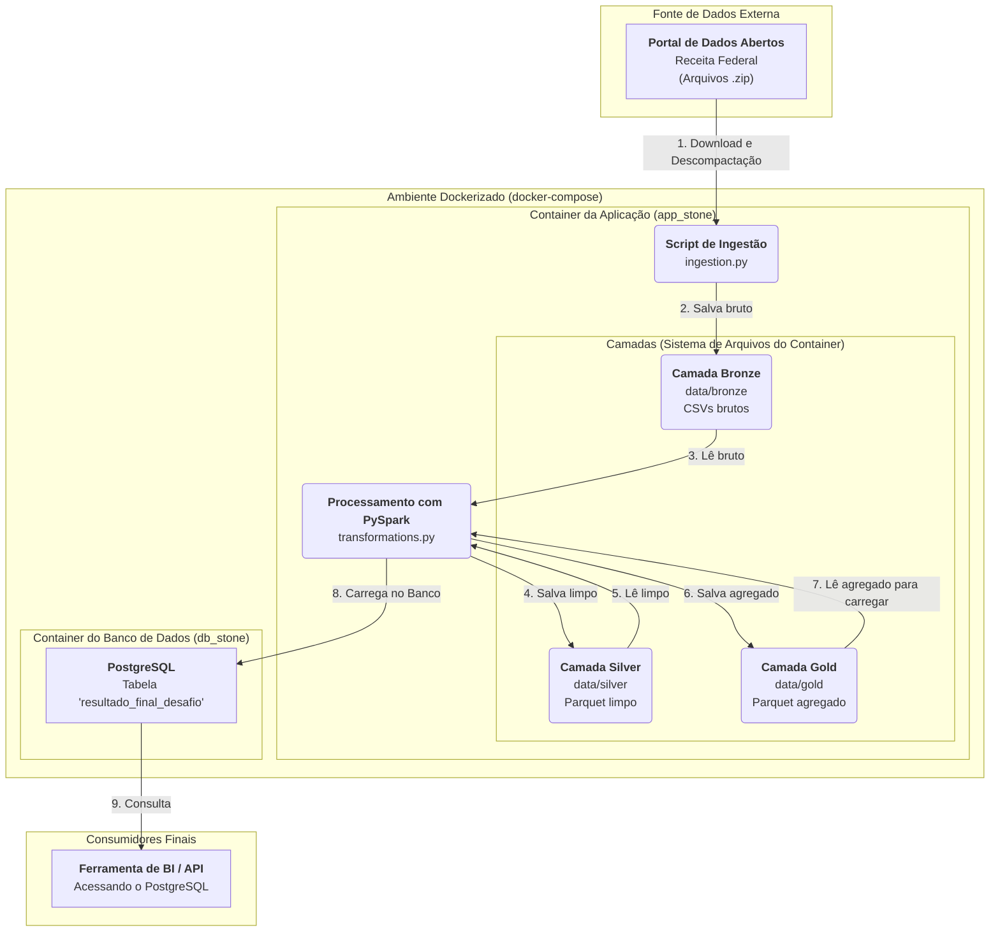

### Desafio de Engenharia de Dados - Pipeline da Receita Federal
Este repositório contém a solução para o desafio de engenharia de dados, que consiste em construir um pipeline para ingestão, processamento e armazenamento de dados públicos de CNPJ da Receita Federal.

### 📝 Descrição do Projeto
O pipeline foi construído utilizando a arquitetura Medallion **(Bronze, Silver, Gold)** para garantir a qualidade e a rastreabilidade dos dados. O processo completo é orquestrado com Docker e Docker Compose, permitindo que todo o ambiente seja executado com um único comando.

**Camada Bronze:** Ingestão dos dados brutos (.zip) da fonte oficial.

**Camada Silver:** Limpeza, padronização de schemas, conversão de tipos e armazenamento em formato Parquet.

**Camada Gold:** Aplicação das regras de negócio solicitadas no desafio (cálculo de quantidade de sócios, flags, etc.), com o resultado salvo em Parquet e carregado em um banco de dados.

### 🏛️ Desenho da Arquitetura da Solução
O diagrama abaixo ilustra o fluxo completo, desde a fonte dos dados até o armazenamento final:

```mermaid
graph TD;
    subgraph "Fonte de Dados Externa"
        A["<b>Portal de Dados Abertos</b><br>Receita Federal<br>(Arquivos .zip)"]
    end

    subgraph "Ambiente Dockerizado (docker-compose)"
        subgraph "Container da Aplicação (app_stone)"
            B("<b>Script de Ingestão</b><br>ingestion.py")
            
            subgraph "Camadas (Sistema de Arquivos do Container)"
                C("<b>Camada Bronze</b><br>data/bronze<br>CSVs brutos")
                D("<b>Camada Silver</b><br>data/silver<br>Parquet limpo")
                E("<b>Camada Gold</b><br>data/gold<br>Parquet agregado")
            end

            F("<b>Processamento com PySpark</b><br>transformations.py")
        end

        subgraph "Container do Banco de Dados (db_stone)"
            G["<b>PostgreSQL</b><br>Tabela 'resultado_final_desafio'"]
        end
    end

    subgraph "Consumidores Finais"
        H["<b>Ferramenta de BI / API</b><br>Acessando o PostgreSQL"]
    end

    %% Fluxo do Pipeline
    A -->|"1. Download e Descompactação"| B;
    B -->|"2. Salva bruto"| C;
    C -->|"3. Lê bruto"| F;
    F -->|"4. Salva limpo"| D;
    D -->|"5. Lê limpo"| F;
    F -->|"6. Salva agregado"| E;
    E -->|"7. Lê agregado para carregar"| F;
    F -->|"8. Carrega no Banco"| G;
    G -->|"9. Consulta"| H;
```

### 🛠️ Tecnologias Utilizadas
- **Linguagem:** Python 3.12

- **Processamento de Dados:** Apache Spark (via PySpark)

- **Banco de Dados:** PostgreSQL

- **Orquestração e Ambiente:** Docker e Docker Compose

### 🚀 Como Executar o Projeto
**Pré-requisitos:**
- Git

- Docker e Docker Compose instalados e em execução.

**Passo a Passo:**
1. **Clone o repositório:**

`git clone https://github.com/gmendes-eng/desafio-data-engineer-receita-federal.git`

2. **Navegue até a pasta do projeto:**

`cd desafio-data-engineer-receita-federal`

3. **Execute o pipeline com Docker Compose:**

`docker-compose up --build`

Este único comando irá construir a imagem da aplicação, baixar todas as dependências, iniciar o container do banco de dados e executar o pipeline completo de ponta a ponta. O processo pode levar vários minutos na primeira execução.

### ✅ Como Verificar o Resultado
Após a execução bem-sucedida, você pode verificar o resultado de duas formas:

1. **Arquivos Físicos:**
As saídas de cada camada são salvas na pasta `data/`, permitindo auditoria e validação:

- `data/bronze`: Contém os dados brutos descompactados.

- `data/silver`: Contém os dados limpos em formato Parquet.

- `data/gold`: Contém o resultado final em formato Parquet.

2. **Banco de Dados PostgreSQL:**
O resultado final é carregado na tabela resultado_final_desafio. Você pode usar um cliente de banco de dados (como DBeaver ou DataGrip) para se conectar com as seguintes credenciais:

- **Host:** `localhost`

- **Porta:** `5432`

- **Banco de Dados:** `stone_db`

- **Usuário:** `user`

- **Senha:** `password`

### 📄 Documentação de Referência
O layout e o schema dos arquivos brutos da Receita Federal foram baseados na documentação oficial disponibilizada pelo governo.

- **Layout dos Arquivos:** [Metadados dos Dados Abertos de CNPJ](https://www.gov.br/receitafederal/dados/cnpj-metadados.pdf)