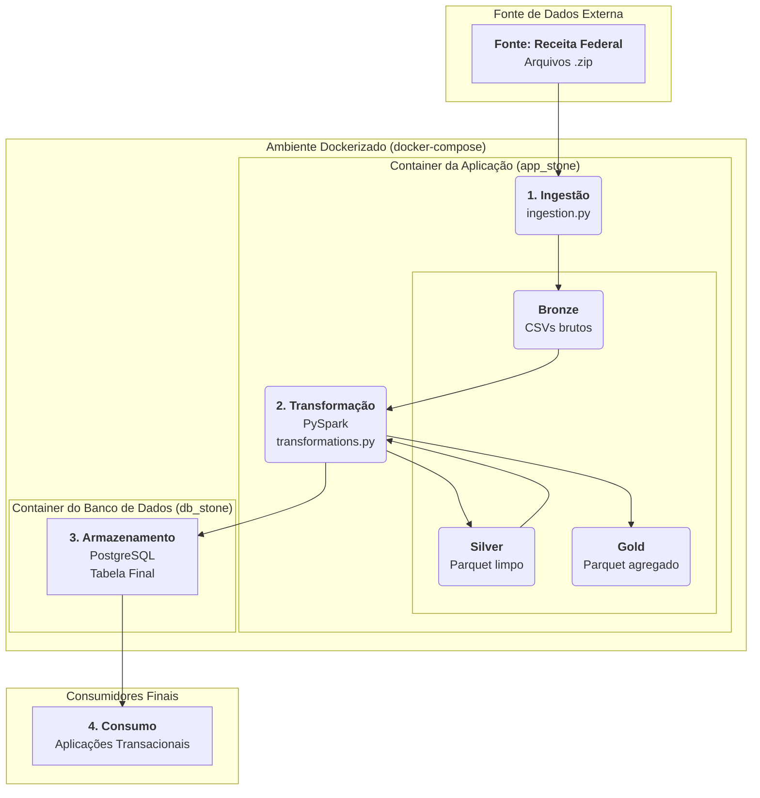

### Desafio de Engenharia de Dados - Pipeline da Receita Federal
Este repositório contém a solução para o desafio de engenharia de dados, que consiste em construir um pipeline para ingestão, processamento e armazenamento de dados públicos de CNPJ da Receita Federal.

### Descrição do Projeto
O pipeline foi construído utilizando a arquitetura Medallion **(Bronze, Silver, Gold)** para garantir a qualidade e a rastreabilidade dos dados. O processo completo é orquestrado com Docker e Docker Compose, permitindo que todo o ambiente seja executado com um único comando.

**Camada Bronze:** Ingestão dos dados brutos (.zip) da fonte oficial.

**Camada Silver:** Limpeza, padronização de schemas, conversão de tipos e armazenamento em formato Parquet.

**Camada Gold:** Aplicação das regras de negócio solicitadas no desafio (cálculo de quantidade de sócios, flags, etc.), com o resultado salvo em Parquet e carregado em um banco de dados.

### Desenho da Arquitetura da Solução
O diagrama abaixo ilustra o fluxo completo, desde a fonte dos dados até o armazenamento final:

### Tecnologias Utilizadas
- **Linguagem:** Python 3.12

- **Processamento de Dados:** Apache Spark (via PySpark)

- **Banco de Dados:** PostgreSQL

- **Orquestração e Ambiente:** Docker e Docker Compose

### Como Executar o Projeto
**Pré-requisitos:**
- Git

- Docker e Docker Compose instalados e em execução.

**Passo a Passo:**
1. **Clone o repositório:**

`git clone https://github.com/gmendes-eng/desafio-data-engineer-receita-federal.git`

2. **Navegue até a pasta do projeto:**

`cd desafio-data-engineer-receita-federal`

3. **Execute o pipeline com Docker Compose:**

`docker-compose up --build`

Este único comando irá construir a imagem da aplicação, baixar todas as dependências, iniciar o container do banco de dados e executar o pipeline completo de ponta a ponta. O processo pode levar vários minutos na primeira execução.

### Como Verificar o Resultado
Após a execução bem-sucedida, você pode verificar o resultado de duas formas:

1. **Arquivos Físicos:**
As saídas de cada camada são salvas na pasta `data/`, permitindo auditoria e validação:

- `data/bronze`: Contém os dados brutos descompactados.

- `data/silver`: Contém os dados limpos em formato Parquet.

- `data/gold`: Contém o resultado final em formato Parquet.

2. **Banco de Dados PostgreSQL:**
O resultado final é carregado na tabela resultado_final_desafio. Você pode usar um cliente de banco de dados (como DBeaver ou DataGrip) para se conectar com as seguintes credenciais:

- **Host:** `localhost`

- **Porta:** `5432`

- **Banco de Dados:** `stone_db`

- **Usuário:** `user`

- **Senha:** `password`

### Documentação de Referência
O layout e o schema dos arquivos brutos da Receita Federal foram baseados na documentação oficial disponibilizada pelo governo.

- **Layout dos Arquivos:** [Metadados dos Dados Abertos de CNPJ](https://www.gov.br/receitafederal/dados/cnpj-metadados.pdf)