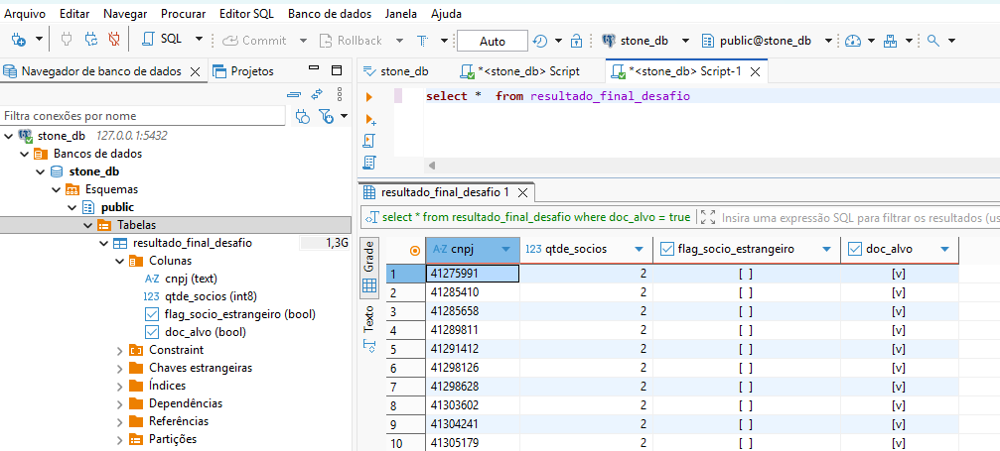
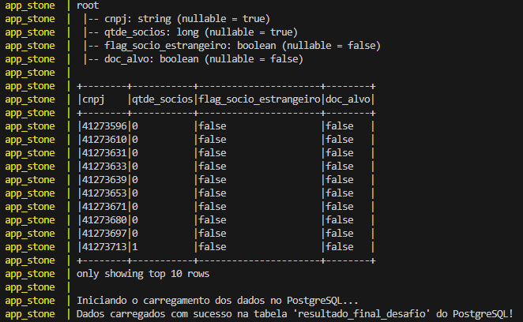

### Desafio de Engenharia de Dados - Pipeline da Receita Federal

### 1. Objetivo
Este projeto tem como objetivo realizar a ingestão e o processamento de dados cadastrais de empresas e sócios, disponibilizados publicamente pela Receita Federal. O pipeline de dados foi construído para extrair, transformar e carregar essas informações, culminando em uma tabela final com indicadores de negócio específicos.

### 2. Arquitetura de Dados: Medallion com Delta Lake
O projeto segue o modelo de arquitetura Medallion, organizando os dados em três camadas distintas (Bronze, Silver e Gold) para garantir qualidade, governança e performance. Para as camadas de dados estruturados, utilizamos o formato **Delta Lake**, que oferece transações ACID, versionamento de dados e confiabilidade sobre o Data Lake.

**Camada Bronze**

A camada de dados brutos, dividida em três estágios para máxima rastreabilidade e resiliência:

- `data/bronze/landing/archives/`: Contém os arquivos `.zip` originais baixados diretamente do endpoint da Receita Federal. Esta é a cópia fiel e imutável da fonte.

- `data/bronze/landing/unzipped_csvs/`: Armazena os arquivos de dados extraídos dos `.zip` em seu formato original (CSV delimitado por ponto e vírgula  e texto de largura fixa).

- `data/bronze/raw/`: Primeira camada persistida em um formato estruturado e confiável. Os dados da unzipped_csvs são lidos e gravados como tabelas Delta (`empresas.delta`, `socios.delta`), servindo como uma fonte única da verdade para as próximas etapas.

**Camada Silver**

A camada de dados limpos e enriquecidos.

- `data/silver/`: As tabelas Delta da camada `raw` são lidas, e aqui aplicamos as transformações:

- Renomeação e padronização dos nomes das colunas.

- Limpeza de dados e tratamento de valores nulos.

- Aplicação dos tipos de dados corretos para cada coluna (ex: string, int, float).

- Enriquecimento de dados, se necessário.

- O resultado são novas tabelas Delta, limpas e prontas para a modelagem de negócio.

**Camada Gold**

A camada final, com dados agregados e modelados para consumo.

- `data/gold/`: Contém a tabela de negócio final (`resultado_final.delta`). Esta tabela é criada a partir da camada Silver para responder a perguntas específicas do desafio, como:

    - Calcular a quantidade de sócios por CNPJ (`qtde_socios`).

    - Identificar empresas com sócios estrangeiros (`flag_socio_estrangeiro`).

    - Aplicar regras de negócio para classificar um CNPJ (`doc_alvo`).

### 3. Estrutura do Projeto

```
.
├── data/                   <-- Diretório de dados da arquitetura Medallion.
│   ├── bronze/             <-- Camada de dados brutos, inalterados da fonte.
│   │   ├── landing/
│   │   │   ├── archives/         <-- (1) Arquivos .zip originais baixados da Receita.
│   │   │   └── unzipped_csvs/    <-- (2) Arquivos de dados brutos, extraídos dos .zip
│   │   └── raw/
│   │       ├── empresas.delta/   <-- (3) Tabela Delta com os dados de Empresas
│   │       └── socios.delta/     <-- (3) Tabela Delta com os dados de Sócios.
│   ├── silver/             <-- Camada de dados limpos, padronizados e enriquecidos.
│   │   ├── empresas.delta/
│   │   └── socios.delta/
│   └── gold/               <-- Camada de dados agregados, prontos para análise de negócio.
│       └── resultado_final.delta/
│
├── src/                    <-- Código-fonte Python do pipeline ETL.
│   ├── __init__.py
│   ├── database.py         <-- Módulo de conexão e carga no banco de dados.
│   ├── ingestion.py        <-- Script para ingestão e criação da Camada Bronze.
│   ├── main.py             <-- Orquestrador principal que executa o pipeline.
│   ├── transformations.py  <-- Script para as transformações da camadas Silver.
│   └── aggregations.py     <-- Script para as agregações da camada Gold.
│
├── .gitignore              <-- Especifica arquivos a serem ignorados pelo Git.
├── docker-compose.yml      <-- Orquestra os contêineres da aplicação (Python, DB, etc.).
├── Dockerfile              <-- Define o ambiente e dependências da aplicação.
├── LICENSE
├── README.md               <-- Documentação do projeto.
└── requirements.txt        <-- Lista de bibliotecas Python necessárias.
```
**Desenho da Arquitetura da Solução**

A imagem abaixo ilustra a arquitetura do projeto, desde a fonte dos dados até o armazenamento final:


### 4. Tecnologias Utilizadas
- **Linguagem:** Python 3.12

- **Orquestração e Ambiente**: Docker e Docker Compose.

- **Processamento de Dados**: Apache Spark (via PySpark) para manipulação de grandes volumes de dados.

- **Formato de Tabela**: Delta Lake para garantir confiabilidade e performance nas camadas do Data Lake.

- **Banco de Dados (Output)**: PostgreSQL, um banco de dados relacional, ideal para aplicações transacionais.

### 5. Como Executar o Projeto
**Pré-requisitos:**
- Git
- Docker e Docker Compose instalados e em execução.

**Execução:**
1. **Clone o repositório:**

`git clone https://github.com/gmendes-eng/desafio-data-engineer-receita-federal.git`

2. **Navegue até a pasta do projeto:**

`cd desafio-data-engineer-receita-federal`

3. **Execute o pipeline com Docker:**

`docker-compose up --build`

Este comando irá construir a imagem Docker, instalar as dependências, iniciar os serviços (como o banco de dados) e executar o pipeline de dados principal definido em `src/main.py`.

### 6. Como Verificar o Resultado
Após a execução bem-sucedida, você pode verificar o resultado de duas formas:

1. **Arquivos Físicos:**
As saídas de cada camada são salvas na pasta `data/`, permitindo auditoria e validação:

- `data/bronze/raw`: Contém os dados brutos descompactados em formato delta.

- `data/silver`: Contém os dados limpos em formato delta.

- `data/gold`: Contém o resultado final em formato delta.

2. **Banco de Dados PostgreSQL:**
O resultado final é carregado na tabela resultado_final_desafio. Você pode usar um cliente de banco de dados (como DBeaver ou DataGrip) para se conectar com as seguintes credenciais:

- **Host:** `localhost`

- **Porta:** `5432`

- **Banco de Dados:** `stone_db`

- **Usuário:** `user`

- **Senha:** `password`

### 7. Descrição do Pipeline
O fluxo de trabalho orquestrado pelo `main.py` executa as seguintes etapas:

1. **Ingestão (Bronze)**: O script `ingestion.py` é chamado para:
- Baixar os arquivos `.zip` da Receita Federal para a pasta `landing/archives`.
- Descompactar os arquivos na pasta `landing/unzipped_csvs`.
- Converter os arquivos brutos em tabelas Delta na camada raw.

2. **Transformação (Silver)**: O script `transformations.py` é executado para:
- Ler as tabelas Delta da camada `raw`.
- Aplicar as limpezas e padronizações, gerando as tabelas da camada `silver`.

3. **Agregação (Gold)**: O script `aggregation.py` é executado para:
- Ler as tabelas Delta da camada `silver`.
- Realizar as agregações e regras de negócio, criando a tabela final na camada `gold`.

4. **Carregamento (Load)**: O script `database.py` é responsável por:
- Ler a tabela final da camada `gold`.
- Conectar-se ao banco de dados PostgreSQL.
- Carregar os dados processados na tabela de destino, disponibilizando o resultado para consumo.

### 8. Evidências de Execução

Esta seção apresenta evidências visuais do funcionamento do pipeline e do resultado final gerado.

- **Resultado Final no Banco de Dados**

A imagem abaixo demonstra a tabela `resultado_final_desafio` carregada com sucesso no banco de dados PostgreSQL.


- **Logs de Execução do Pipeline**

O screenshot a seguir exibe os logs do terminal após a conclusão do `docker-compose up`, mostrando a execução sequencial das etapas de ingestão, transformação e carga no banco de dados.


- **Amostra de dados das tabelas gravada na camada Silver**


- **Amostra de dados da tabela final na camada Gold e carregamento dos dados no PostgreSQL** 


### 9. Documentação de Referência
O layout e o schema dos arquivos brutos da Receita Federal foram baseados na documentação oficial disponibilizada pelo governo.

- **Layout dos Arquivos:** [Metadados dos Dados Abertos de CNPJ](https://www.gov.br/receitafederal/dados/cnpj-metadados.pdf)